# Use Case Diagram (Mermaid Format)

Bạn có thể view diagram này trên GitHub hoặc các Markdown viewer hỗ trợ Mermaid.

## Lưu ý về Actors
- **Guest**: Chỉ có thể XEM nội dung, không tương tác được → Không có trong diagram
- **User**: Người dùng đã đăng nhập, có đầy đủ quyền sử dụng
- **Premium User**: Kế thừa từ User + quyền Premium
- **Admin**: Kế thừa từ User + quyền quản trị
- **Payment System**: Hệ thống SePay xử lý thanh toán

```mermaid
graph TB
    subgraph Actors
        User((User))
        Premium((Premium User))
        Admin((Admin))
        Payment[Payment System<br/>SePay]
    end
    
    subgraph "Music Streaming Service"
        subgraph "1. Authentication"
            UC1[Sign Up]
            UC2[Login]
            UC3[Logout]
            UC4[OAuth Login]
            UC1a[Validate Email]
            UC2a[Validate Credentials]
        end
        
        subgraph "2. Play Music"
            UC5[Play/Pause Song]
            UC6[Next/Previous Track]
            UC7[Adjust Volume]
            UC8[Seek Progress]
            UC9[View Queue]
            UC10[Add to Queue]
            UC5a[Load Audio]
            UC5b[Update History]
        end
        
        subgraph "3. Library Management"
            UC11[Upload Song]
            UC12[Create Playlist]
            UC13[Edit Playlist]
            UC14[Add to Playlist]
            UC15[Delete Playlist]
            UC16[Like/Unlike Song]
            UC17[View Liked Songs]
            UC18[Delete Song]
            UC11a[Validate File Format]
            UC11b[Upload to Storage]
            UC12a[Generate Playlist Color]
            UC15a[Confirm Delete]
        end
        
        subgraph "4. Search & Browse"
            UC19[Search Songs]
            UC20[Browse by Album]
            UC21[Browse by Artist]
            UC22[Browse by Genre]
            UC23[Advanced Search]
            UC24[View History]
            UC19a[Query Database]
        end
        
        subgraph "5. Premium Subscription"
            UC25[View Plans]
            UC26[Subscribe Premium]
            UC27[Generate QR Payment]
            UC28[Process Payment]
            UC29[Activate Subscription]
            UC30[Cancel Subscription]
            UC27a[Create Transaction Code]
            UC28a[Verify Transaction]
            UC29a[Update User Role]
        end
        
        subgraph "6. Admin Functions"
            UC31[Manage Users]
            UC32[Manage Content]
            UC33[View Analytics]
        end
    end
    
    %% ========== USER CONNECTIONS (Full) ==========
    User --> UC1
    User --> UC2
    User --> UC3
    User --> UC4
    User --> UC5
    User --> UC6
    User --> UC7
    User --> UC8
    User --> UC9
    User --> UC10
    User --> UC11
    User --> UC12
    User --> UC13
    User --> UC14
    User --> UC15
    User --> UC16
    User --> UC17
    User --> UC18
    User --> UC19
    User --> UC20
    User --> UC21
    User --> UC22
    User --> UC23
    User --> UC24
    User --> UC25
    User --> UC26
    
    %% ========== PREMIUM USER CONNECTIONS (Inherits User + Cancel) ==========
    Premium -.->|inherits| User
    Premium --> UC1
    Premium --> UC2
    Premium --> UC3
    Premium --> UC4
    Premium --> UC5
    Premium --> UC6
    Premium --> UC7
    Premium --> UC8
    Premium --> UC9
    Premium --> UC10
    Premium --> UC11
    Premium --> UC12
    Premium --> UC13
    Premium --> UC14
    Premium --> UC15
    Premium --> UC16
    Premium --> UC17
    Premium --> UC18
    Premium --> UC19
    Premium --> UC20
    Premium --> UC21
    Premium --> UC22
    Premium --> UC23
    Premium --> UC24
    Premium --> UC25
    Premium --> UC30
    
    %% ========== ADMIN CONNECTIONS (Inherits User + Admin Functions) ==========
    Admin -.->|inherits| User
    Admin --> UC1
    Admin --> UC2
    Admin --> UC3
    Admin --> UC4
    Admin --> UC5
    Admin --> UC6
    Admin --> UC7
    Admin --> UC8
    Admin --> UC9
    Admin --> UC10
    Admin --> UC11
    Admin --> UC12
    Admin --> UC13
    Admin --> UC14
    Admin --> UC15
    Admin --> UC16
    Admin --> UC17
    Admin --> UC18
    Admin --> UC19
    Admin --> UC20
    Admin --> UC21
    Admin --> UC22
    Admin --> UC23
    Admin --> UC24
    Admin --> UC25
    Admin --> UC26
    Admin --> UC30
    Admin --> UC31
    Admin --> UC32
    Admin --> UC33
    
    %% ========== PAYMENT SYSTEM CONNECTIONS ==========
    Payment --> UC28
    Payment --> UC29
    
    %% ========== INCLUDE RELATIONSHIPS ==========
    UC1 -.->|include| UC1a
    UC2 -.->|include| UC2a
    UC5 -.->|include| UC5a
    UC5 -.->|include| UC5b
    UC11 -.->|include| UC11a
    UC11 -.->|include| UC11b
    UC12 -.->|include| UC12a
    UC15 -.->|include| UC15a
    UC18 -.->|include| UC15a
    UC19 -.->|include| UC19a
    UC26 -.->|include| UC25
    UC26 -.->|include| UC27
    UC27 -.->|include| UC27a
    UC28 -.->|include| UC28a
    UC28 -.->|include| UC29
    UC29 -.->|include| UC29a
    
    %% ========== EXTEND RELATIONSHIPS ==========
    UC4 -.->|extend| UC2
    UC23 -.->|extend| UC19
    UC19 -.->|extend| UC5
    UC20 -.->|extend| UC5
    UC21 -.->|extend| UC5
    UC22 -.->|extend| UC5
    UC10 -.->|extend| UC5
    UC9 -.->|extend| UC5
    UC14 -.->|extend| UC12
    UC30 -.->|extend| UC25
    
    %% ========== STYLING ==========
    style UC1 fill:#e1f5ff
    style UC2 fill:#e1f5ff
    style UC3 fill:#e1f5ff
    style UC4 fill:#e1f5ff
    style UC5 fill:#fff4e1
    style UC6 fill:#fff4e1
    style UC7 fill:#fff4e1
    style UC8 fill:#fff4e1
    style UC9 fill:#fff4e1
    style UC10 fill:#fff4e1
    style UC11 fill:#f0ffe1
    style UC12 fill:#f0ffe1
    style UC13 fill:#f0ffe1
    style UC14 fill:#f0ffe1
    style UC15 fill:#f0ffe1
    style UC16 fill:#f0ffe1
    style UC17 fill:#f0ffe1
    style UC18 fill:#f0ffe1
    style UC19 fill:#ffe1f5
    style UC20 fill:#ffe1f5
    style UC21 fill:#ffe1f5
    style UC22 fill:#ffe1f5
    style UC23 fill:#ffe1f5
    style UC24 fill:#ffe1f5
    style UC26 fill:#ffe1e1
    style UC27 fill:#ffe1e1
    style UC28 fill:#ffe1e1
    style UC29 fill:#ffe1e1
    style UC30 fill:#ffe1e1
    style UC31 fill:#e1e1ff
    style UC32 fill:#e1e1ff
    style UC33 fill:#e1e1ff
```

---

## Giải thích màu sắc

| Màu | Use Case Group |
|-----|----------------|
| 🔵 Xanh dương nhạt | Authentication |
| 🟡 Vàng nhạt | Play Music |
| 🟢 Xanh lá nhạt | Library Management |
| 🟣 Hồng nhạt | Search & Browse |
| 🔴 Đỏ nhạt | Premium Subscription |
| 🔮 Tím nhạt | Admin Functions |

---

## Include vs Extend

### Include (Bắt buộc - đường nét đứt với label "include")
Use case cha **BẮT BUỘC** phải thực hiện use case con
- Login **include** Validate Credentials
- Play Song **include** Load Audio
- Upload Song **include** Validate File Format

### Extend (Tùy chọn - đường nét đứt với label "extend")
Use case con **CÓ THỂ** mở rộng từ use case cha trong một số điều kiện
- OAuth Login **extend** Login (khi user chọn đăng nhập OAuth)
- Advanced Search **extend** Search Songs (khi user cần tìm kiếm nâng cao)
- Search Songs **extend** Play Song (khi user click vào kết quả để phát)

---

## Cách xem diagram

### 1. GitHub
- Push file này lên GitHub
- Mermaid sẽ tự động render

### 2. VS Code
- Cài extension "Markdown Preview Mermaid Support"
- Ctrl+Shift+V để xem preview

### 3. Online
- Copy phần code mermaid vào https://mermaid.live/
